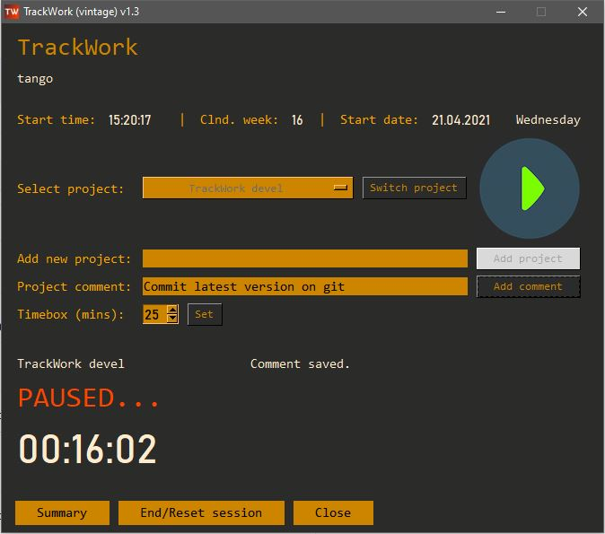

# TrackWork-win
## A desktop App that helps you keep a track of your time spent on projects.

**What is TrackWork?**
---
A desktop App that helps you keep a track of your time spent on projects. It is primarily built for projects on workstations, PCs and tablets. 
However, its usage can go further beyond.

**How do I launch it?**
---
Once the zipped file is unpacked, place the folder in your desired location and simply launch the TrackWork-v1.3.exe

**How does it work?**
---
(*** Please hover over a button or filed with your cursor to get tooltips ***)
1. **Setup**
- Username: The username can be changed by clicking on the username button, adding your name or alias in the appearing filed and pressing the 'Enter' keyboard key.
There is no option to change the username once you move onto the next GUI. You will have to restart the App to change it in the Setup GUI again
- Project list: The list can be viewed in the dropdown list. By default, the first value is 'Select...'. If using the first time, you will have to add the projects you would be working on
- Add new project: Enter your project name and click on the 'Add' button or press the 'Enter' keyboard key
- Delete project: If you wish to delete a project, select it in the dropdown option, click on 'Delete project', then click on 'Confirm'. This will delete the selected project and update the project list instantly
- Next: This will take you to the main TrackWork window

2. **TrackWork**
- The Start time, Clnd. week and Start date get displayed as soon as you start using the GUI, for example by clicking the 'Play' button or pressing the ESC keyboard key
- Select project: The project you wish to work on can be selected using the drop down. 
- Add new project: If you have missed adding a project in the previous 'Setup' step or wish to add a new project, follow the same steps as before
- Play/Pause button: Once selected, press the Play button or press the 'Enter' keyboard key. To pause you can press the 'Enter' keyboard again or do it using the cursor
- Project comment: Allows you to add comments or remarks to the current project. Press 'Add comment' or press the 'Enter' keyboard key
- Switch project: This button gets activated once you 'Pause' a project. This button also allows you to switch to another project. Each time you switch the time spent
and comments for your previous project are automatically recorded at the backend. This button also activates the Add new project option once you have started off with a project
- Timebox: This options lets you timebox your current project. Add the box time in minutes, press the Set button and continue working on your projects. At the end of the 
boxed time you receive a popup alert indicating the box time is over. The session will continue to run in the background. This is a good tool for time efficiency
- Summary: View the session summary at any point during the session. Viewing the summary does not pause the project eventhough the timer may appear to have paused
- End/Reset session: Once clicked this will end the current session and reset all values to zeros and export the session summary to a text file and also display the 
information in a new window. This does not Close the App and you can start a new session.
- Close: Once clicked, this will end the current session and reset all values to zeros and export the session summary to a text file and also display the 
information in a new window. Then, it closes the App

- If you restart the App it will contain the username and projects you had previously entered, so you do not have to enter them again.
- The current status/activity of the project can be viewed at the bottom half of the window including the Active project, PAUSED/ACTIVE status and the time elapsed
for the current project

**Things to note:**
---
- DO NOT delete the build folder as it contains binaries required to run the .exe which are not embedded within the .exe itself
- Once you start using it, the content that you enter will be saved in database and shelved files in the same folder where the .exe file is located. If you delete these
files, the stored content will be lost. You have an option of selectively deleting 'Projects' in the Setup GUI
- Each time you 'End/Reset' or 'Close' a session, the session summary will be shown in a separate window as well as stored in a text file within the same folder
- If you quit the App using the 'X' button at the top right corner, the session summary will NOT be saved
